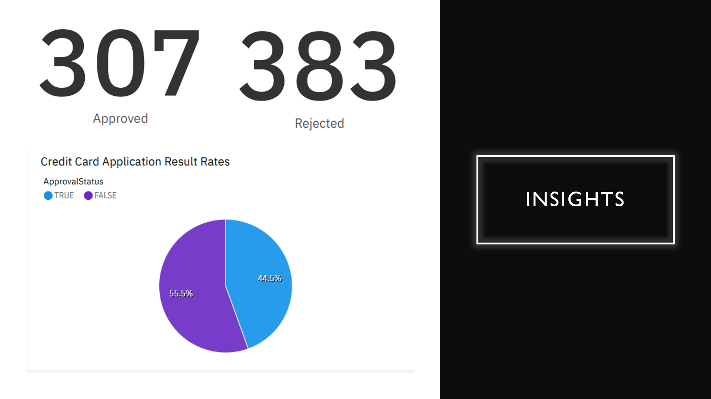
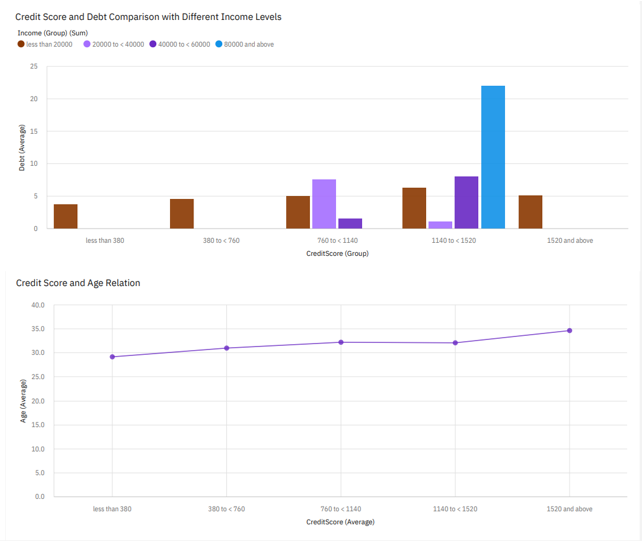
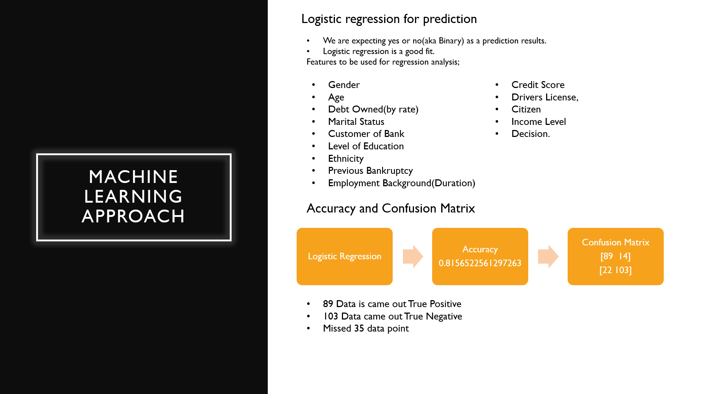

<h1> Credit Card Application Decision Making </h1>

Project is trying to achive decision making on credit card applications by machine learning. I have used one of local bank in Turkey for data.

<h3>Background:</h3>
<ol>
    <li>Python and Pandas for data manipulating.</li>
    <li>Linear regression for machine learning algorithm</li>
    <li>IBM Cognos for data visualization and insights.</li>
   
</ol>
<h2>Screenshots</h2>
<table>
        <tr>
            <td></td> 
        </tr>
        <tr>     
            <td></td>
        </tr>
        <tr>
            <td></td>   
        </tr>
       
</table>
<h2>Tech:</h2>

    
    
    
    

